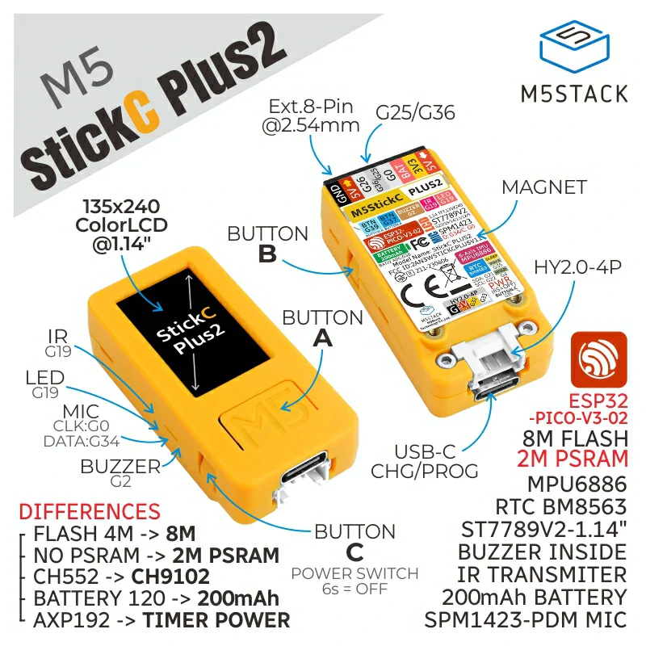

# Proyectos para M5Stick hechos en UIFlow Ver.1

## Introducción

Este repositorio tiene por finalidad mostrar los proyectos que he realizado con el M5Stick, programados en UIFlow Version 1. Es una colección de proyectos realizados a lo largo del tiempo e incluye programas de prueba, utilidades y proyectos específicos, desde aplicaciones simples y sencillas hasta proyectos mas complejos. Si eres un estudiante, hobbysta o maker, espero que estos proyectos te sirvan para aprender el uso y programación del M5Stick para que realices tus propios diseños.

