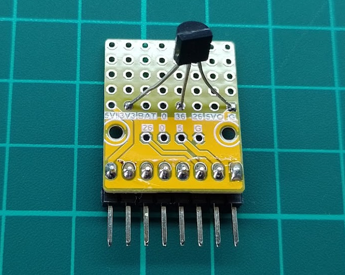

Lee valores de temperatura ambiente con el sensor TMP36 montado en un proto HAT del M5Stick como se puede ver en la siguiente imagen.

El TMP36 está conectado a 3V3 y GND y la salida de tensión se conecta al pin G36.

